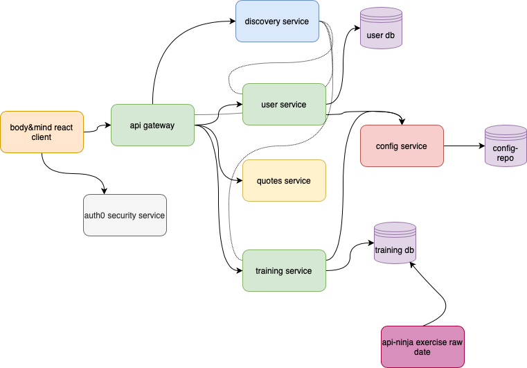

# Body & Mind App - Client

Bod&Mind is born from the phrase **Mens sana in corpore sano** in Latin, meaning _" a healthy mind in a healthy body "_. The phrase is used to explain that physical exercise plays or can play a big role in mental well-being.

Our app creates a space for users to follow programs with different workouts and exercises, as well as set and rep instructions, created by our official trainers. As well as being able to create and customize their own programs.

With a minimal and straightforward design, Body&Mind is the perfect place for you to **_take care of your mind by taking care of your body_**.

## Application Structure

 

## Set Up

1. Clone or Download the project from the repository.

2. Open the directory as a project on a IDE such as Visual Studio.

3. Open a new terminal inside the project folder where the `package.json` is and run `npm install`.

4. Ensure your server is running (follow readme guide lines [here](https://github.com/Openbank-Java-Bootcamp/Lisa-Body-and-Mind-server))

5. In the same terminal (inside the project folder) run `npm start`

 

### Technologies Used

JavaScriptReact HooksAuth0

 

## Routes

| Route                       | Page Component        | Access             |
| --------------------------- | --------------------- | ------------------ |
| /                           | `HomePage`            | Public             |
| \*                          | `ErrorPage`           | Public             |
| /profile                    | `ProfilePage`         | Authenticated User |
| /programs                   | `ProgramsPage`        | Authenticated User |
| /programs/:programId        | `ProgramDetailsPage`  | Authenticated User |
| /programs/new               | `CreateProgramPage`   | Authenticated User |
| /programs/edit/:programId   | `EditProgramPage`     | Authenticated User |
| /workouts/:workoutId        | `WorkoutDetailsPage`  | Authenticated User |
| /workouts/edit/:workoutId   | `EditWorkoutPage`     | Authenticated User |
| /exercises/:exerciseId      | `ExerciseDetailsPage` | Authenticated User |
| /exercises/edit/:exerciseId | `EditExercisePage`    | Authenticated User |
| /sets/edit/:setId           | `EditSetPage`         | Authenticated User |

 

## Components

- `ProgramList` used in ProgramsPage.
- `WorkoutList` used in ProgramDetailsPage.
- `NewWorkout` used in ProgramDetailsPage.
- `ExerciseList` used in WorkoutDetailsPage.
- `NewExercise` used in WorkoutDetailsPage.
- `SetList` used in ExerciseDetailsPage.
- `NewSet` used in ExerciseDetailsPage.
- `SetDetails` used in SetList.
- `RepDetails` used in SetDetails.
- `SetDetails` used in SetList.
- `RepDetails` used in SetDetails.
- `NewRep` used in RepDetails.

Other

- `Navbar` used globally.
- `NewUser` used in HomePage and ProfilePage when user first logs in to add more details.
- `NoDataMessage` used in varios components when a certain call returns no objects as they've yet to be created.
- `PrivateRoute` to protect routes and redirect to log in / sign up page if there isn't an authenticated and authorized user.
- `LoginButton` and `LogoutButton` Auth0 buttons.

 

## Future Work

- Implementing exercise sessions so users can train with Boy&Mind in real time.

- Providing a free & premium plan (free offering only the programs created by trainers in general, premium being the program customization part)

- Setting up pages for trainers and gyms to create programs and event.

 

## Resources

[Auth0 Step to Step guide for react SPA](https://auth0.com/docs/quickstart/spa/react/01-login)

[Trello](https://trello.com/b/xrk45zcW/bodymind)

[Presentation slides](https://prezi.com/view/JRALWjNTbLOeUsSti07n/)
